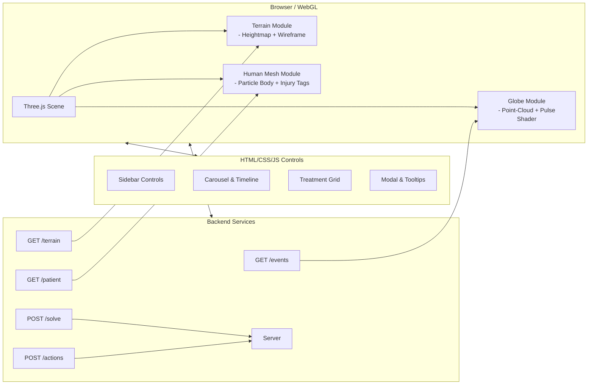
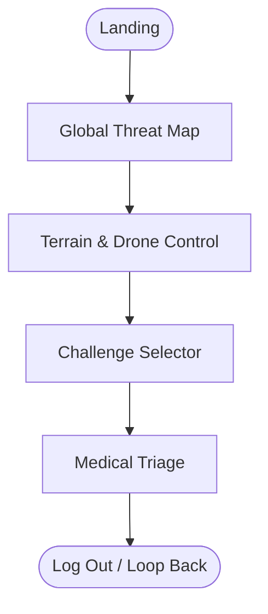

# Product Requirements Document

**Project:** STEM Tactical Interface
**Author:** \[\[Ahmet Melih Afşar]]
**Date:** \[\[2025-05-03]]
**Version:** 1.0

---

## 1. Executive Summary

**Purpose:**
Create a browser-based, WebGL/Three.js–powered tactical UI that blends data visualization, 3D interactivity, and a post-futuristic “Matrix-meets-military” aesthetic.

**Scope:**
Five core screens:

1. **Global Threat Map**
2. **Terrain & Drone Control**
3. **Challenge Selector**
4. **Medical Triage**
5. **(Future expansion)**

**Success Metrics:**

* Initial load < 3 s on desktop (Chrome, Firefox, Safari)
* Sustained 60 FPS on mid-range GPU
* ≥ 90% task completion rate in usability tests

---

## 2. Goals & Objectives

|  ID | Goal                                                                                   | Priority |
| :-: | :------------------------------------------------------------------------------------- | :------: |
|  G1 | Deliver real-time, 3D globe visualization with animated threat pulses                  |   High   |
|  G2 | Enable intuitive waypoint planning over 3D terrain with drag-and-drop drone icons      |   High   |
|  G3 | Offer a visually striking “challenge carousel” that users can scrub through seamlessly |  Medium  |
|  G4 | Provide a high-fidelity, interactive medical triage interface with 3D patient mesh     |   High   |
|  G5 | Maintain responsiveness down to 1280×720 resolution                                    |  Medium  |

---

## 3. User Personas

* **Tactical Analyst (Alex)**

  * Needs to visualize global events quickly
  * Moderate technical literacy

* **Drone Operator (Riley)**

  * Plans drone flight paths, monitors battery & payload
  * High technical literacy

* **Field Medic (Casey)**

  * Performs rapid triage under pressure
  * Moderate technical literacy

---

## 4. Functional Requirements

### 4.1 Global Threat Map

* **FR-1:** Render a 3D globe using point-cloud mesh of white dots.
* **FR-2:** Animate concentric “pulse” rings at explosion coordinates.
* **FR-3:** Sidebar showing historic “Explosion X/Y/Z” and dynamic “Current X/Y/Z” under the cursor.
* **FR-4:** “Solve” panel with three numeric inputs (X, Y, Z) and a Solve button.

### 4.2 Terrain & Drone Control

* **FR-5:** Render procedurally generated 3D heightmap with wireframe overlay.
* **FR-6:** Toggle between **Thermal** and **Spectral** heatmap modes.
* **FR-7:** Drag waypoint icons (△, □, ◯) from the control panel onto the terrain—cells highlight on hover.
* **FR-8:** Display scanned vs. positive counts and show latest scan thumbnail.

### 4.3 Challenge Selector

* **FR-9:** Carousel of geometric challenge icons rendered as glowing line-loops.
* **FR-10:** On select, highlight frame animates in and a label (e.g. “Clear Path”) fades in.
* **FR-11:** Timeline scrubber below allows jumping between challenge steps.

### 4.4 Medical Triage

* **FR-12:** Render a 3D point-cloud/particle human mesh in wireframe.
* **FR-13:** Label injuries with connector lines (e.g. “Forehead Contusion,” “3rd-Degree Burn – Neck”).
* **FR-14:** HUD displays vitals: heart rate (bpm), SpO₂ (%), Life (%) as charts/gauges.
* **FR-15:** Treatment grid with paginated action buttons (Irrigate, Debris Removal, Pain Medicine, etc.).

---

## 5. Non-Functional Requirements

* **NFR-1 (Performance):** ≥ 60 FPS sustained on desktop GPUs; globe module ready in < 2 s.
* **NFR-2 (Compatibility):** Support Chrome ≥ 100, Firefox ≥ 95, Safari ≥ 15.
* **NFR-3 (Responsiveness):** Fully functional down to 1280×720 resolutions.
* **NFR-4 (Accessibility):** Keyboard navigable; color contrast ≥ 4.5:1; ARIA labels for critical controls.

---

## 6. UI/UX & Visual Style

### 6.1 Visual Clues & Interaction Patterns

| Element                   | Behavior & Details                                                                                                                            |
| ------------------------- | --------------------------------------------------------------------------------------------------------------------------------------------- |
| **Point-Cloud Meshes**    | Millions of white “stipple” dots form globes, terrains, bodies—evoking a digital data-aura. Particles gently drift to imply “live” data.      |
| **Geometric Overlays**    | Angular wireframes (mountains, grid-lines) give a cyber-architectural, post-futuristic feel. Subtle morphing loops indicate dynamic activity. |
| **Neon Amber Accents**    | Pulsing rings, glyph highlights, and selection outlines in warm yellow-orange (#FFB400) cut sharply through the monochrome backdrop.          |
| **Deep Space Black Base** | Background is near-black with subtle film grain & vignette, creating a “stealth mission” ambience.                                            |
| **Subtle Glitch & Grain** | Occasional scan-line flicker, static noise, and lens-flare artifacts suggest high-tech surveillance hardware.                                 |
| **Minimalist Typography** | Monospaced, all-caps labels in white, occasionally amber. Technical yet legible under stress.                                                 |
| **Animated Transitions**  | Smooth fades, elastic “pops” on selection, and timeline scrubbing that eases between discrete challenge states.                               |
| **Particle & Depth**      | Floating sparks, drifting specks, and parallax stars add depth—like peering through a HUD’s glass canopy.                                     |
| **Iconography & Glyphs**  | Simplified shapes (△, □, ◯) with micro-animations signal drag-and-drop readiness, lock states, and active tasks.                              |
| **Cinematic Framing**     | Wide aspect letterboxing, off-center focal points, and subtle camera pans deliver a movie-trailer spectacle.                                  |

### 6.2 Overall Vibe & Feel

> **A high-tech mission-briefing console** crossed with dystopian sci-fi—clinical yet urgent. Every dot, line, and neon pulse feels data-driven and battle-ready. Users should sense both the gravitas of life-or-death decisions and the beauty of cutting-edge WebGL artistry.

---

## 7. Technical Architecture

---

## 8. User Flow

---

## 9. Analytics & Telemetry

* **Events Tracked:**

  * Screen views (enter/exit)
  * Button clicks (Solve, Submit, Treat)
  * Drag/drop waypoints
  * Selection changes in carousel & heatmap
* **Endpoint:** `POST /analytics/events` (JSON payload)

---

## 10. Risks & Mitigations

| Risk                          | Probability | Impact | Mitigation                                        |
| ----------------------------- | :---------: | :----: | ------------------------------------------------- |
| WebGL instability on low-end  |    Medium   |  High  | Fallback: 2D Canvas static map version            |
| Network latency delays module |     High    | Medium | Lazy-load modules; animated skeleton placeholders |
| Accessibility gaps            |     Low     |  High  | Early axe-core audits; manual keyboard testing    |

---

## 11. Open Questions

1. **Mobile/Tablet Support?** Scope vs. performance trade-off?
2. **Offline Caching:** Terrain tile persistence?
3. **LOD Strategy:** Dynamic mesh detail for human body?

---

## 12. Next Steps

1. **Spike (2 days):** Prototype Three.js globe + pulsing shader with point-cloud.
2. **Design (3 days):** Flesh out screens in Figma, applying amber accent rules & glitch overlays.
3. **Accessibility Audit (1 day):** Run automated + manual checks on key flows.
